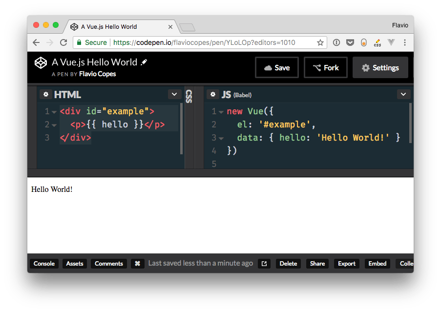
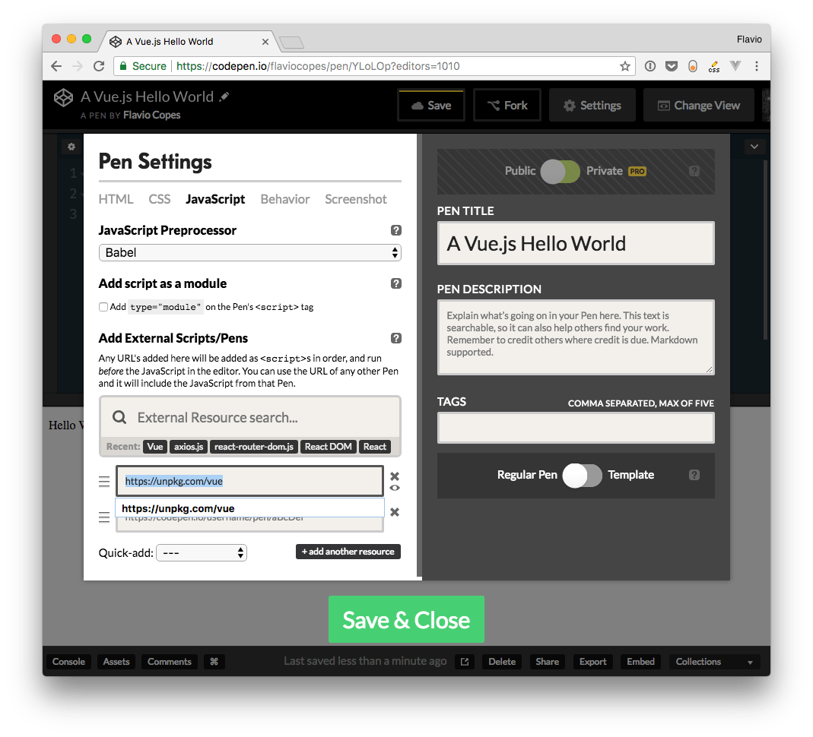
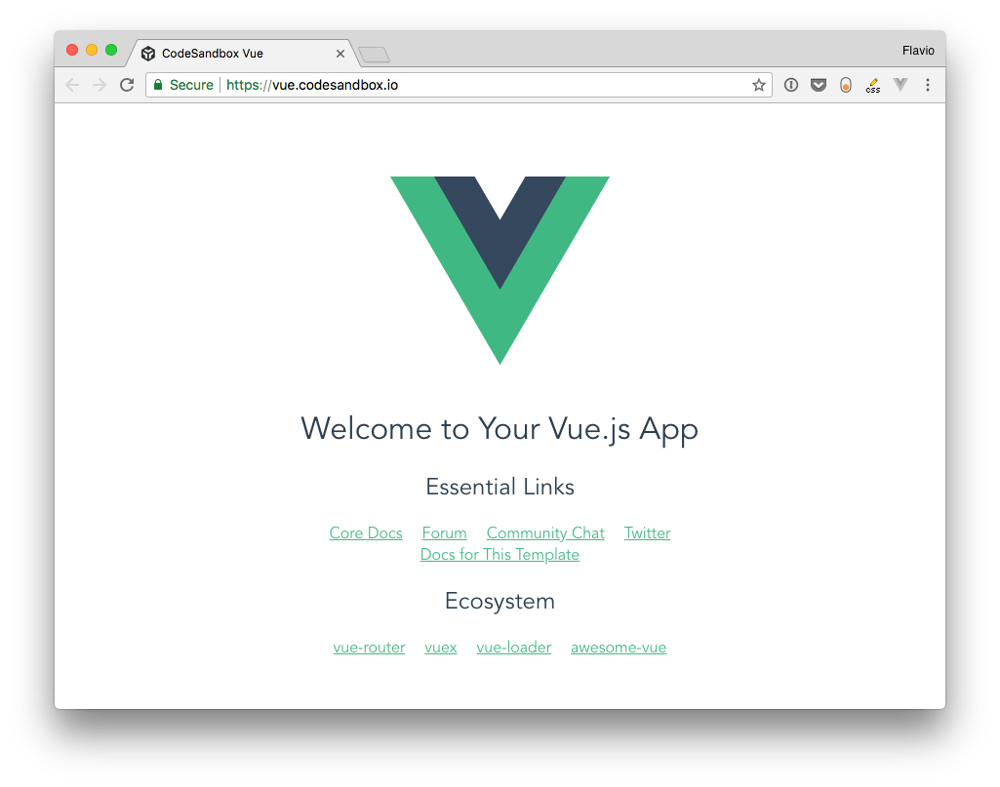

If you've never created a Vue.js application, I am going to guide you through the task of creating one, and understanding how it works.

## First example

First I'll use the most basic example of using Vue.

You create an HTML file which contains

```html
<html>
  <body>
    <div id="example">
      <p>{{ hello }}</p>
    </div>
    <script src="https://unpkg.com/vue"></script>
    <script>
        new Vue({
            el: '#example',
            data: { hello: 'Hello World!' }
        })
    </script>
  </body>
</html>
```

and you open it in the browser. That's your first Vue app! The page should show a "Hello World!" message.

I put the script tags at the end of the body so that they are executed in order after the DOM is loaded.

What this code does is, we instantiate a new Vue app, linked to the `#example` element as its template (it's defined using a CSS selector usually, but you can also pass in an HTMLElement).

Then, it associates that template to the `data` object. That is a special object that hosts the data we want Vue to render.

In the template, the special `{{ }}` tag indicates that's some part of the template that's dynamic, and its content should be looked up in the Vue app data.

### See on Codepen

You can see this example on Codepen: <https://codepen.io/flaviocopes/pen/YLoLOp>



Codepen is a little different from using a plain HTML file, and you need to configure it to point to the Vue library location in the Pen settings:



## Second example: the Vue CLI default app

Let's level up the game a little bit. The next app we're going to build is already done, and it's **the Vue CLI default application**.

What is the Vue CLI? It's a command line utility that helps to speed up development by scaffolding an application skeleton for you, with a sample app in place.

There are two ways you can get this application.

### Use the Vue CLI locally

The first is to install the Vue CLI on your computer and run the command

```bash
vue create <enter the app name>
```

### Use CodeSandbox

A simpler way, without having to install anything, is to go to <https://codesandbox.io/s/vue>.

CodeSandbox is a cool code editor that allows you build apps in the cloud, which allows you to use any npm package and also easily integrate with Zeit Now for an easy deployment and GitHub to manage versioning.

That link I put above opens the Vue CLI default application.

Whether you chose to use the Vue CLI locally, or through CodeSandbox, let's inspect that Vue app in details.

### The files structure

Beside `package.json`, which contains the configuration, these are the files contained in the initial project structure:

- `index.html`
- `src/App.vue`
- `src/main.js`
- `src/assets/logo.png`
- `src/components/HelloWorld.vue`

#### `index.html`

The `index.html` file is the main app file.

In the body it includes just one simple element: `<div id="app"></div>`. This is the element the Vue application will use to attach to the DOM.

```html
<!DOCTYPE html>
<html>

<head>
  <meta charset="utf-8">
  <meta name="viewport" content="width=device-width,initial-scale=1.0">
  <title>CodeSandbox Vue</title>
</head>

<body>
  <div id="app"></div>
  <!-- built files will be auto injected -->
</body>

</html>
```

#### `src/main.js`

This is the main JavaScript files that drive our app.

We first import the Vue library and the App component from `App.vue`.

We set productionTip to false, just to avoid Vue to output a "_you're in development mode_" tip in the console.

Next, we create the Vue instance, by assigning it to the DOM element identified by `#app`, which we defined in `index.html`, and we tell it to use the App component.

```js
// The Vue build version to load with the `import` command
// (runtime-only or standalone) has been set in webpack.base.conf with an alias.
import Vue from 'vue'
import App from './App'

Vue.config.productionTip = false

/* eslint-disable no-new */
new Vue({
  el: '#app',
  components: { App },
  template: '<App/>'
})
```

#### `src/App.vue`

`App.vue` is a Single File Component. It contains 3 chunks of code: HTML, CSS and JavaScript.

This might seem weird at first, but Single File Components are a great way to create self-contained components that have all they need in a single file.

We have the markup, the JavaScript that is going to interact with it, and style that's applied to it, which can be scoped, or not. In this case, it's not scoped, and it's just outputting that CSS which is applied like regular CSS to the page.

The interesting part lies in the `script` tag.

We import a **component** from the `components/HelloWorld.vue` file, which we'll describe later.

This component is going to be referenced in our component. It's a dependency. We are going to output this code:

```html
<div id="app">
  
  <HelloWorld/>
</div>
```

from this component, which you see references the HelloWorld component. Vue will automatically insert that component inside this placeholder.

```js
<template>
  <div id="app">
    
    <HelloWorld/>
  </div>
</template>

<script>
import HelloWorld from './components/HelloWorld'

export default {
  name: 'App',
  components: {
    HelloWorld
  }
}
</script>

<style>
#app {
  font-family: 'Avenir', Helvetica, Arial, sans-serif;
  -webkit-font-smoothing: antialiased;
  -moz-osx-font-smoothing: grayscale;
  text-align: center;
  color: #2c3e50;
  margin-top: 60px;
}
</style>
```

#### `src/components/HelloWorld.vue`

Here's the HelloWorld component, which is included by the App component.

This component outputs a set of links, along with a message.

Remember above we talked about CSS in App.vue, which was not scoped? The HelloWorld component has scoped CSS.

You can easily determine it by looking at the `style` tag. If it has the `scoped` attribute, then it's scoped: `<style scoped>`

This means that the generated CSS will be targeting the component uniquely, via a class that's applied by Vue transparently. You don't need to worry about this, and you know the CSS won't _leak_ to other parts of the page.

The message the component outputs is stored in the `data` property of the Vue instance, and outputted in the template as `{{ msg }}`.

Anything that's stored in `data` is reachable directly in the template via its own name. We didn't need to say `data.msg`, just `msg`.

```html
<template>
  <div class="hello">
    <h1>{{ msg }}</h1>
    <h2>Essential Links</h2>
    <ul>
      <li>
        <a
          href="https://vuejs.org"
          target="_blank"
        >
          Core Docs
        </a>
      </li>
      <li>
        <a
          href="https://forum.vuejs.org"
          target="_blank"
        >
          Forum
        </a>
      </li>
      <li>
        <a
          href="https://chat.vuejs.org"
          target="_blank"
        >
          Community Chat
        </a>
      </li>
      <li>
        <a
          href="https://twitter.com/vuejs"
          target="_blank"
        >
          Twitter
        </a>
      </li>
      <br>
      <li>
        <a
          href="http://vuejs-templates.github.io/webpack/"
          target="_blank"
        >
          Docs for This Template
        </a>
      </li>
    </ul>
    <h2>Ecosystem</h2>
    <ul>
      <li>
        <a
          href="http://router.vuejs.org/"
          target="_blank"
        >
          vue-router
        </a>
      </li>
      <li>
        <a
          href="http://vuex.vuejs.org/"
          target="_blank"
        >
          vuex
        </a>
      </li>
      <li>
        <a
          href="http://vue-loader.vuejs.org/"
          target="_blank"
        >
          vue-loader
        </a>
      </li>
      <li>
        <a
          href="https://github.com/vuejs/awesome-vue"
          target="_blank"
        >
          awesome-vue
        </a>
      </li>
    </ul>
  </div>
</template>

<script>
export default {
  name: 'HelloWorld',
  data() {
    return {
      msg: 'Welcome to Your Vue.js App'
    }
  }
}
</script>

<!-- Add "scoped" attribute to limit CSS to this component only -->
<style scoped>
h1,
h2 {
  font-weight: normal;
}
ul {
  list-style-type: none;
  padding: 0;
}
li {
  display: inline-block;
  margin: 0 10px;
}
a {
  color: #42b983;
}
</style>
```

### Run the app

CodeSandbox has a cool preview functionality. You can run the app and edit anything in the source to have it immediately reflected in the preview.


