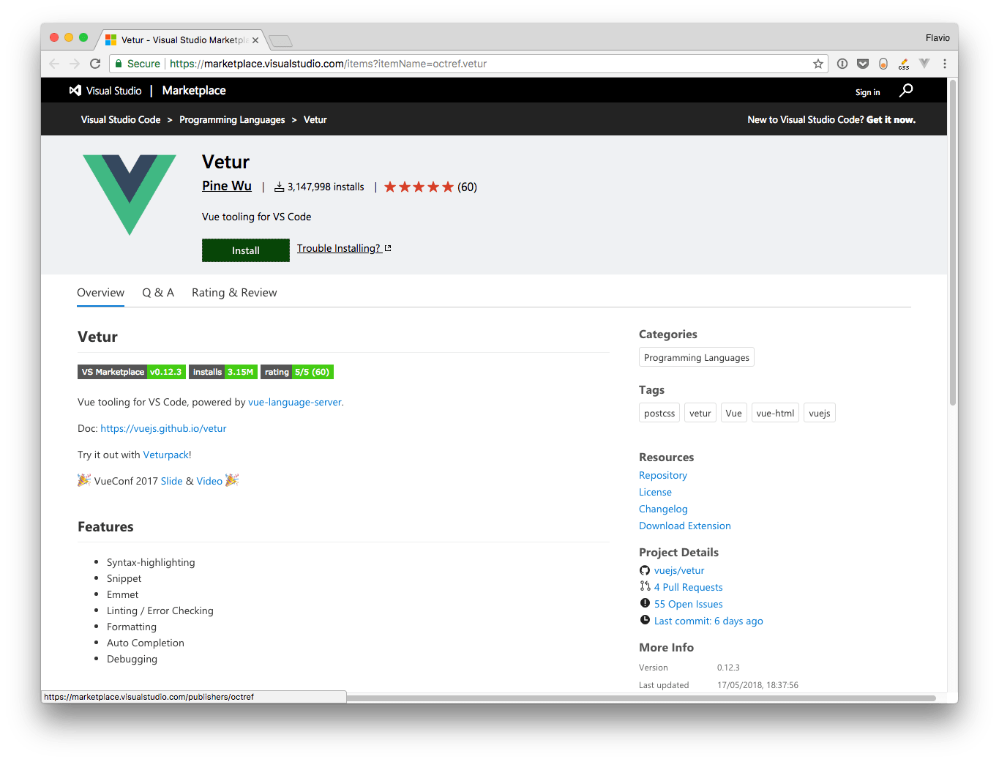
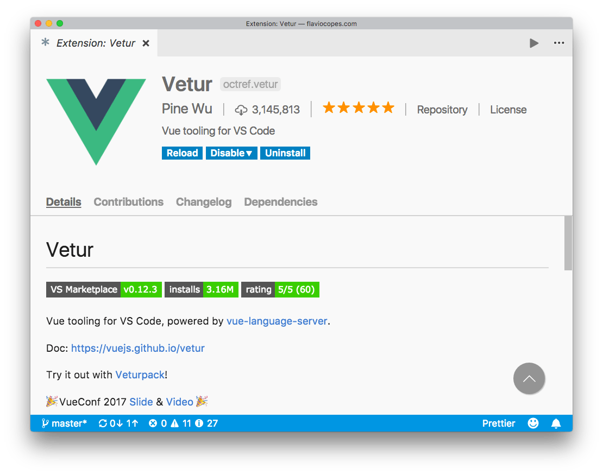
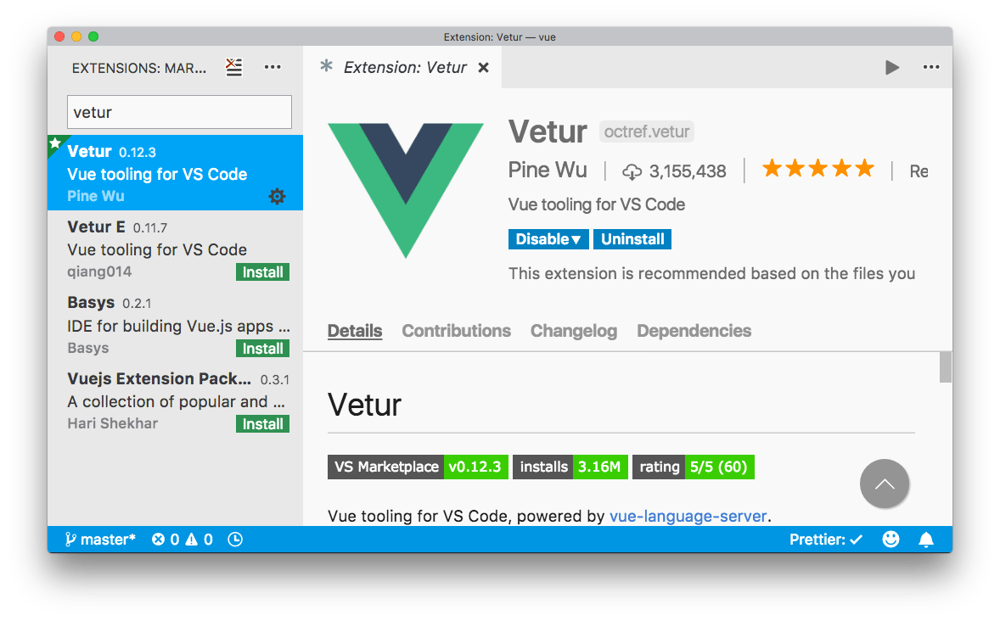
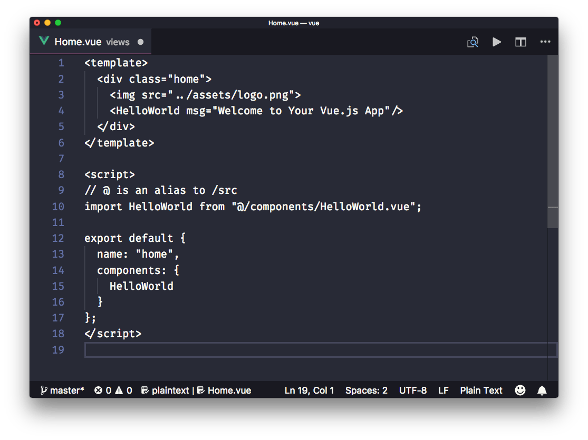
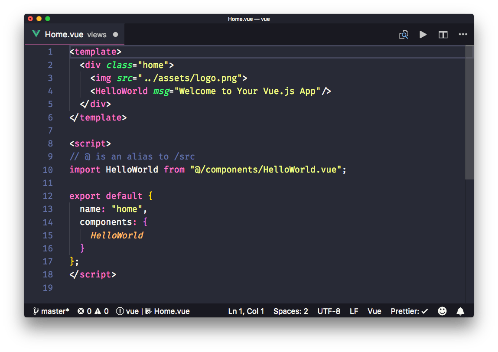
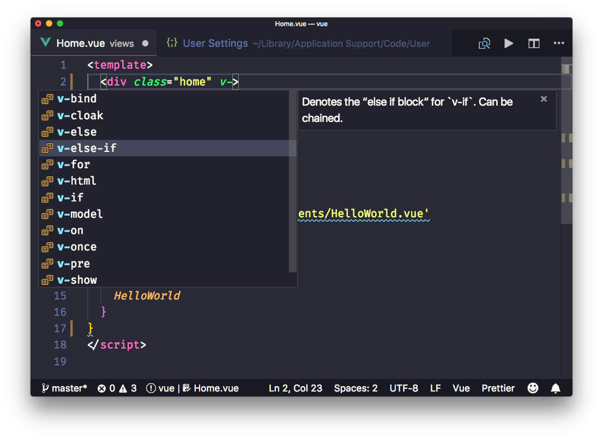
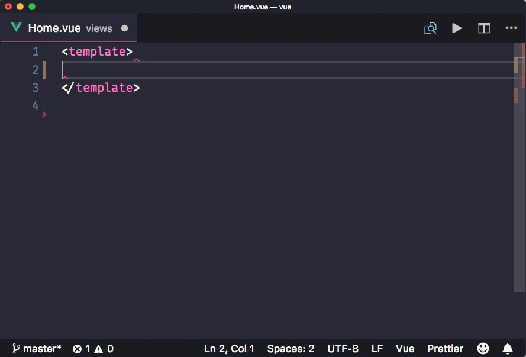
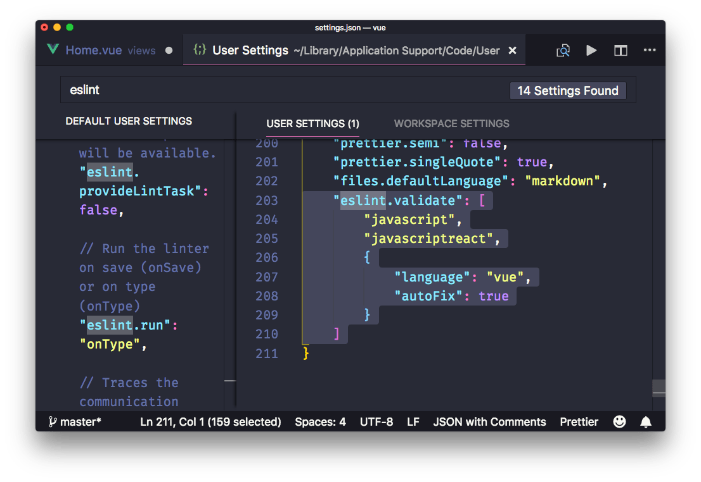
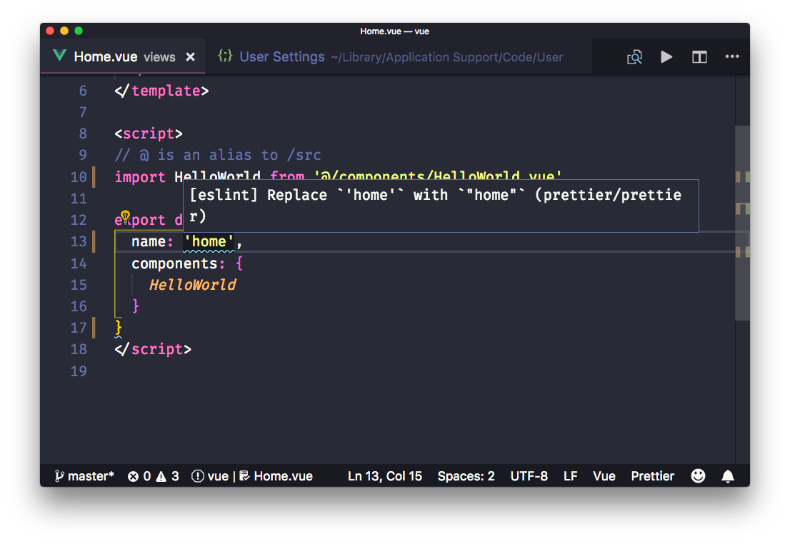

Visual Studio Code is one of the most used code editors in the world right now. Editors have, like many software products, a cycle. Once TextMate was the favorite among developers, then it was Sublime Text, now it's VS Code.

The cool thing about being popular is that people dedicate a lot of time to building plugins for everything they imagine.

One of such plugins is an awesome tool that can help us Vue.js developers.

## Vetur

It's called **Vetur**, it's hugely popular, with more than 3 million downloads, and you can find it [on the Visual Studio Marketplace](https://marketplace.visualstudio.com/items?itemName=octref.vetur).



## Installing Vetur

Clicking the Install button will trigger the installation panel in VS Code:



You can also simply open the Extensions in VS Code and search for "vetur":



What does this extension provide?

## Syntax highlighting

Vetur provides syntax highlighting for all your Vue source code files.

Without Vetur, a .vue file will be displayed in this way by VS Code:



with Vetur installed:



VS Code is able to recognize the type of code contained in a file from its extension.

Using Single File Component, you mix different types of code inside the same file, from CSS to JavaScript to HTML.

VS Code by default cannot recognize this kind of situation, and Vetur allows to provide syntax highlighting for each kind of code you use.

Vetur enables support, among the others, for

- HTML
- CSS
- JavaScript
- Pug
- Haml
- SCSS
- PostCSS
- Sass
- Stylus
- TypeScript

## Snippets

As with syntax highlighting, since VS Code cannot determine the kind of code contained in a part of a .vue file, it cannot provide the snippets we all love: pieces of code we can add to the file, provided by specialized plugins.

Vetur provides VS Code the ability to use your favorite snippets in Single File Components.

## IntelliSense

IntelliSense is also enabled bye Vetur, for each different language, with autocomplete:



## Scaffolding

In addition to enabling custom snippets, Vetur provides its own set of snippets. Each one creates a specific tag (template, script or style) with its own language:

- `scaffold`
- `template with html`
- `template with pug`
- `script with JavaScript`
- `script with TypeScript`
- `style with CSS`
- `style with CSS (scoped)`
- `style with scss`
- `style with scss (scoped)`
- `style with less`
- `style with less (scoped)`
- `style with sass`
- `style with sass (scoped)`
- `style with postcss`
- `style with postcss (scoped)`
- `style with stylus`
- `style with stylus (scoped)`

If you type `scaffold`, you'll get a starter pack for a single-file component:

```js
<template>

</template>

<script>
export default {

}
</script>

<style>

</style>
```

the others are specific and create a single block of code.

> Note: (scoped) means that it applies to the current component only

## Emmet

Emmet, the popular HTML/CSS abbreviations engine, is supported by default. You can type one of the Emmet abbreviations and by pressing `tab` VS Code will automatically expand it to the HTML equivalent:



## Linting and error checking

Vetur integrates with ESLint, through the [VS Code ESLint plugin](https://marketplace.visualstudio.com/items?itemName=dbaeumer.vscode-eslint).





## Code Formatting

Vetur provides automatic support for code formatting, to format the whole file upon save (in combination with the `"editor.formatOnSave"` VS Code setting.

You can choose to disable automatic formatting for some specific language by setting the `vetur.format.defaultFormatter.XXXXX` to `none` in the VS Code settings. To change one of those settings, just start searching for the string, and override what you want in the user settings (the right panel).

Most of the languages supported use Prettier for automatic formatting, a tool that's becoming an industry standard.

Uses your Prettier configuration to determine your preferences.
