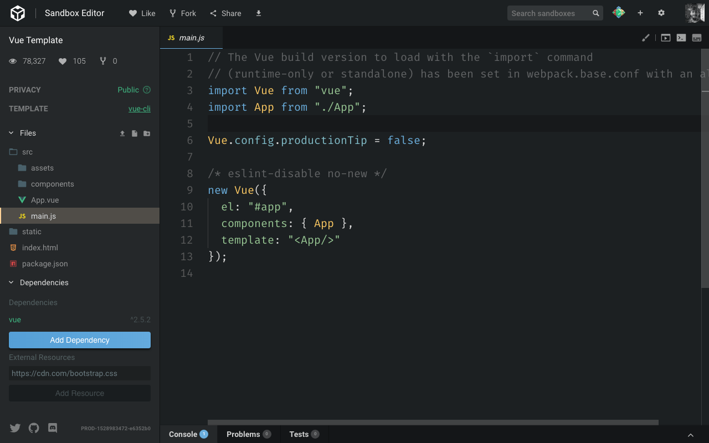
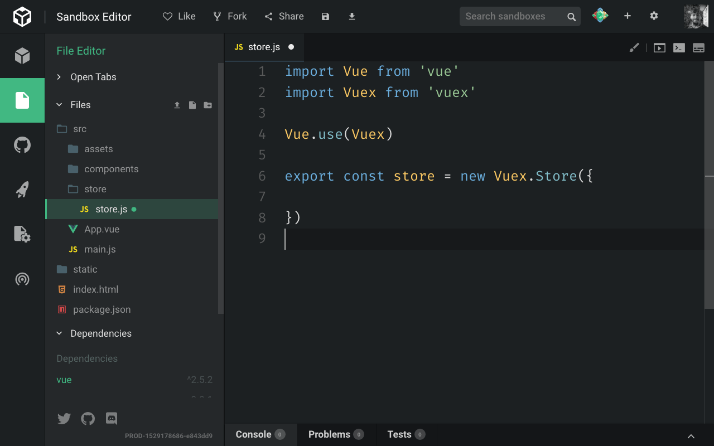

## Introduction to Vuex

Vuex is the official state management library for Vue.js.

Its job is to share data across the components of your application.

Components in Vue.js out of the box can communicate using

- **props**, to pass state down to child components from a parent
- **events**, to change the state of a parent component from a child, or using the root component as an event bus

Sometimes things get more complex than what these simple options allow.

In this case, a good option is to centralize the state in a single store. This is what Vuex does.

## Why should you use Vuex

Vuex is not the only state management option you can use in Vue (you can use Redux too), but its main advantage is that it's official, and its integration with Vue.js is what makes it shine.

With React you have the trouble of having to choose one of the many libraries available, as the ecosystem is huge and has no de-facto standard. Lately Redux was the most popular choice, with MobX following up in terms of popularity. With Vue I'd go as far as to say that you won't need to look around for anything other than Vuex, especially when starting out.

Vuex borrowed many of its ideas from the React ecosystem, as this is the Flux pattern popularized by Redux.

If you know Flux or Redux already, Vuex will be very familiar.
If you don't, no problem - I'll explain every concept from the ground up.

Components in a Vue application can have their own state. For example, an input box will store the data entered into it locally. This is perfectly fine, and components can have local state even when using Vuex.

You know that you need something like Vuex when you start doing a lot of work to pass a piece of state around.

In this case Vuex provides a central repository store for the state, and you mutate the state by asking the store to do that.

Every component that depends on a particular piece of the state will access it using a getter on the store, which makes sure it's updated as soon as that thing changes.

Using Vuex will introduce some complexity into the application, as things need to be set up in a certain way to work correctly, but if this helps solve the unorganized props passing and event system that might grow into a spaghetti mess if too complicated, then it's a good choice.

## Let's start

In this example, I'm starting from a Vue CLI application. Vuex can be used also by directly loading it into a script tag, but since Vuex is more in tune with bigger applications, it's much more likely you will use it on a more structured application, like the ones you can start up quickly with the Vue CLI.

The examples I use will be put CodeSandbox, which is a great service that has a Vue CLI sample ready to go at <https://codesandbox.io/s/vue>. I recommend using it to play around.



Once you're there, click the **Add dependency** button, enter "vuex" and click it.

Now Vuex will be listed in the project dependencies.

To install Vuex locally you can simply run `npm install vuex` or `yarn add vuex` inside the project folder.

## Create the Vuex store

Now we are ready to create our Vuex store.

This file can be put anywhere. It's generally suggested to put it in the `src/store/store.js` file, so we'll do that.

In this file we initialize Vuex and we tell Vue to use it:

```js
import Vue from 'vue'
import Vuex from 'vuex'

Vue.use(Vuex)

export const store = new Vuex.Store({})
```



We export a Vuex store object, which we create using the `Vuex.Store()` API.

## An use case for the store

Now that we have a skeleton in place, let's come up with an idea for a good use case for Vuex, so I can introduce its concepts.

For example, I have 2 sibling components, one with an input field, and one that prints that input field content.

When the input field is changed, I want to also change the content in that second component. Very simple but this will do the job for us.

## Introducing the new components we need

I delete the HelloWorld component and add a Form component, and a Display component.

```html
<template>
	<div>
		<label for="flavor">Favorite ice cream flavor?</label>
		<input name="flavor">
	</div>
</template>
```

```html
<template>
	<div>
		<p>You chose ???</p>
	</div>
</template>
```

## Adding those components to the app

We add them to the App.vue code instead of the HelloWorld component:

```html
<template>
  <div id="app">
    <Form/>
    <Display/>
  </div>
</template>

<script>
import Form from './components/Form'
import Display from './components/Display'

export default {
  name: 'App',
  components: {
    Form,
    Display
  }
}
</script>
```

## Add the state to the store

So with this in place, we go back to the store.js file and we add a property to the store called `state`, which is an object, that contains the `flavor` property. That's an empty string initially.

```js
import Vue from 'vue'
import Vuex from 'vuex'

Vue.use(Vuex)

export const store = new Vuex.Store({
  state: {
    flavor: ''
  }
})
```

We'll update it when the user types into the input field.

## Add a mutation

The state cannot be manipulated except by using **mutations**. We set up one mutation which will be used inside the Form component to notify the store that the state should change.

```js
import Vue from 'vue'
import Vuex from 'vuex'

Vue.use(Vuex)

export const store = new Vuex.Store({
  state: {
    flavor: ''
  },
  mutations: {
    change(state, flavor) {
      state.flavor = flavor
    }
  }
})
```

## Add a getter to reference a state property

With that set, we need to add a way to look at the state. We do so using **getters**. We set up a getter for the `flavor` property:

```js
import Vue from 'vue'
import Vuex from 'vuex'

Vue.use(Vuex)

export const store = new Vuex.Store({
  state: {
    flavor: ''
  },
  mutations: {
    change(state, flavor) {
      state.flavor = flavor
    }
  },
  getters: {
    flavor: state => state.flavor
  }
})
```

Notice how `getters` is an object. `flavor` is a property of this object, which accepts the state as the parameter, and returns the `flavor` property of the state.

## Adding the Vuex store to the app

Now the store is ready to be used. We go back to our application code, and in the main.js file, we need to import the state and make it available in our Vue app.

We add

```js
import { store } from './store/store'
```

and we add it to the Vue application:

```js
new Vue({
  el: '#app',
  store,
  components: { App },
  template: '<App/>'
})
```

Once we add this, since this is the main Vue component, the `store` variable inside every Vue component will point to the Vuex store.

## Update the state on a user action using commit

Let's update the state when the user types something.

We do so by using the `store.commit()` API.

But first, let's create a method that is invoked when the input content changes. We use `@input` rather than `@change` because the latter is only triggered when the focus is moved away from the input box, while `@input` is called on every keypress.

```js
<template>
  <div>
    <label for="flavor">Favorite ice cream flavor?</label>
    <input @input="changed" name="flavor">
  </div>
</template>

<script>
export default {
  methods: {
    changed: function(event) {
      alert(event.target.value)
    }
  }
}
</script>
```

Now that we have the value of the flavor, we use the Vuex API:

```js
<script>
export default {
  methods: {
    changed: function(event) {
      this.$store.commit('change', event.target.value)
    }
  }
}
</script>
```

see how we reference the store using `this.$store`? This is thanks to the inclusion of the store object in the main Vue component initialization.

The `commit()` method accepts a mutation name (we used `change` in the Vuex store) and a payload, which will be passed to the mutation as the second parameter of its callback function.

## Use the getter to print the state value

Now we need to reference the getter of this value in the Display template, by using `$store.getters.flavor`. `this` can be removed because we're in the template, and `this` is implicit.

```html
<template>
  <div>
    <p>You chose {{ $store.getters.flavor }}</p>
  </div>
</template>
```

## Wrapping up

That's it for an introduction to Vuex!

The full, working source code is available at <https://codesandbox.io/s/zq7k7nkzkm>

There are still many concepts missing in this puzzle:

- actions
- modules
- helpers
- plugins

but you have the basics to go and read about them in the official docs.

Happy coding!
